<!-- Banner -->
<!-- 編集中 -->

<h1>Hi, I'm Fybrid! 👋</h2>

<h2>👨‍💻 &nbsp;About Me</h2>

- 🎓 I’m a Japanese student learning software development.
- 💻 I'm currently working on Typescript and PHP projects.
- 🌱 I’m graduating next year and have accepted an offer to work as a Software Engineer.

<!-- TODO: -->
<!-- ## 🌱 Currently Exploring -->

<!-- TODO: -->
<!-- ## 🏆 Achievements -->

<!-- TODO: 言語（技術）とツール分ける -->
<h2>🛠️ &nbsp;Some Tools I Have Used and Learned</h2>

<h2>⚡ &nbsp;GitHub Stats</h2>

